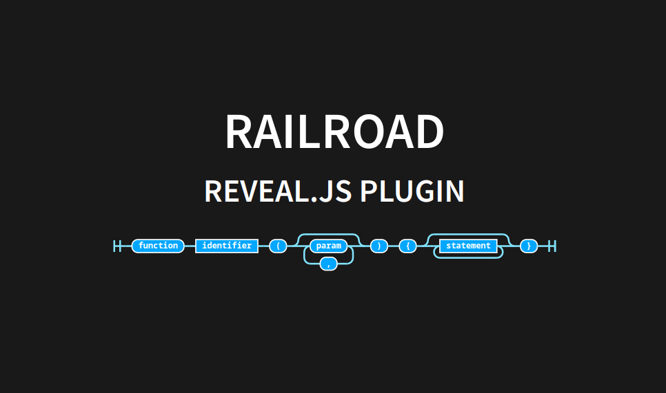

# Reveal.js Railroad-diagram

[](#)

A [reveal.js](https://revealjs.com/) plugin that adds support for Railroad-diagrams.
It is a thin wrapper around the amazing [Railroad-diagram Generator](https://github.com/tabatkins/railroad-diagrams) project.



---

```html
<script type="application/railroad">
  Diagram(
    'function',
    NonTerminal('identifier'),
    '(', ZeroOrMore('param', ','), ')',
    '{', ZeroOrMore(NonTerminal('statement')), '}');
</script>
```

**Important** notes:

- We chose the "holder" to be `<script type="application/railroad">`
- The contained script is **executed** using [`eval`](https://developer.mozilla.org/en-US/docs/Web/JavaScript/Reference/Global_Objects/eval). This could be an enormous security risk if you don't know the authors of your slides.

## Quickstart

### Installation

This plugin is published to, and can be installed from, npm.

```console
npm install add @edc4it/reveal.js-railroad
```

Or using yarn

```console
yarn add @edc4it/reveal.js-railroad
```

### Initialise (as npm library)

```js
import Reveal from 'reveal.js';
import ClipCode from '@edc4it/reveal.js-clipcode';

Reveal.initialize({
  railroad: {
    // Default values
    bg: 'unset',
    pathStroke: '#82e4ff',
    rectFill: '#00a6ff',
    rectStroke: 'white',
    textFill: 'white',
  },
  plugins: [RailRoad],
});
```

### Add a diagram

For the full syntax of "components" see [Railroad-Diagram components](https://github.com/tabatkins/railroad-diagrams/blob/gh-pages/README-js.md#components)

```html
<script type="application/railroad">
  Diagram(
    'function',
    NonTerminal('identifier'),
    '(', ZeroOrMore('param', ','), ')',
    '{', ZeroOrMore(NonTerminal('statement')), '}');
</script>
```

## Global options

```javascript
Reveal.initialize({
  railroad: {
    // Default values
    bg: 'unset',
    pathStroke: '#82e4ff',
    rectFill: '#00a6ff',
    rectStroke: 'white',
    textFill: 'white',
  },
  plugins: [RailRoad],
});
```

- `bg`: the background of the diagram
- `pathStroke`: the color used for the "path" of the railroad diagram,
- `rectFill`: 'the fill/background color of the components
- `rectStroke`: 'the stroke color of the components,
- `textFill`: color of the text inside the components,
